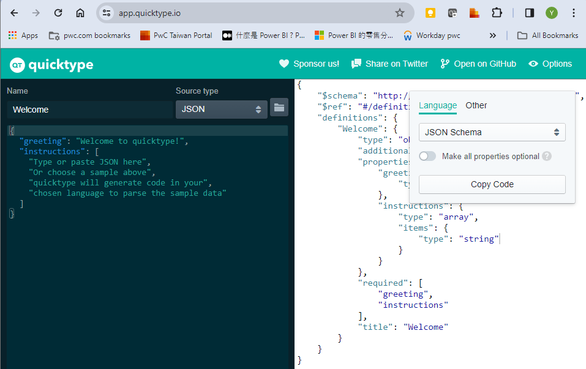

# [2024/02/17] 
## 準備開始開發
1. 請先安裝好 Visual Studio、 VSCode、 nodejs 20 以上
2. 首先，複製這個Project後，請到 [./ReactAspNetApp/reactaspnetapp.client] 的目錄
3. 執行以下scripts後應該就可以使用了
``` powershell
npm install
```
4. VSCode 建議安裝 
- `AndrewMcGoveran.react-component-generator`

## 作業方式 (Pattern)
1. i18n 原則上已經設好，也讓他能夠在 storybook 可以實驗，所以，如果要新增條目的話，有三個檔案要改
- `styles/locales/common.ts`    用來強型別定義用
- `locales/en/common.json` & `locales/zh/common.json`  用來定義中英文的定義，未來看情況，如果條目不多，其實將他們改為 .js 檔會更快。

2. 新增component的話，可以在 `src` 目錄下，按滑鼠右鍵，然後選第五個 `Generate React Component`，就可以在 `src/components` 下造出該component 了。
- 若是在打造ESG要用到的專特頁面等，請到`AppRoot`以下的目錄，他是根據此App的組織結構擺放的，所以，到該相應的目錄，將該目錄當成上面 `src` 來看，同上面步驟，在其內部加入一個 component。
- 若要讓此 component 可以被搜尋到且可以立即跳到，請在他的目錄加上如 [pageMainContainerController.ts](./src/components/AppRoot/components/PageMainContainer/PageMainContainerController.ts)的物件，然後在騎上一層如 [AppRootController.ts](./src/components/AppRoot/AppRootController.ts) 那樣，將它掛進去即可

3. 至於基礎元件則到 [Base](./src/components/Base/) 目錄去找，他的目錄命名法儘量依照 [@MUI/material](https://mui.com/material-ui/) 來命名，大致可以找到其一對一對應。
可以直接拿來安插到ESG頁面使用。

4. 所有Components的Style原則上我現在的作法是以 Theme 與 sx 為主，不過，我有安裝 `tailwind`，也可以寫 `scss` 來控管，
- 全域的，如修改字體等，請到 [GlobalTheme](./src/styles/globalTheme.ts) 去修改
- 個別的，若此 style 是寫死的，那就盡量用 `sx` for MUI(因為它會造classname給 UIElement使用)，如果是會一變再變的，那就用 `style` 來寫。
- 我沒有使用 `.module.scss` ，但不代表他們不能用，請斟酌著使用。

5. Models 的部分，~~目前已經寫好會自動根據 [schemas 裏頭的定義檔如User.json](../modelSchemas/User.json) 來自動產生，我可能會把他移到 DontModify 的子目錄裡，因為這些檔案手動修改會被Build過程給蓋掉，也就是說，自己改這些Models會無效化。 ~~
~~ - 快速產生這些Schema可以透過 [quicktype](https://app.quicktype.io)，左邊選 `JSON` 右邊選 `JSON Schema` 就可以用實際案例值直接得到Schema了。~~
~~  ~~
- 由於我們是先有 DB的定義後才考慮 api，反過來走，所以，現在是透過 EF Core 的 Scaffold 與 generator 產生 Models 與 Controllers，然後再利用 Swagger 生出 Typescript。
- 選擇用 EF Core 是因為考量到未來可能會串接不同類型的 DB，所以，才使用 EF Core ，未來要換 DB，原則上只要修改使用的 DB 的 package，然後，重新產生 Models(主要要變更的是DBContext)，檢查有哪些出入後，應該可以很快轉移才對。
- 由於產生的 Model 是連 DB 的，因此，得再個別打造 DTOs 來串給 Client，所以，生成的 [Model](../ReactAspNetApp.Server/Models/)雖然不用動，但是要自己寫相應的 [DTOs](../ReactAspNetApp.Server/DTOs/)，然後也要修改相應的 [Controllers](../ReactAspNetApp.Server/Controllers/)。
- 由於現在資料庫結構其實尚未完全確定，因此，有用到 `IMapper`，所以，得在 DTOs 裡宣告轉換的 Profile ，並且將它安插進 [Program.cs](../ReactAspNetApp.Server/Program.cs) 裡，這樣，在 Controllers 裡才能使用。
- 根據實際操作，一旦DB修改後，再重新產生Model時，他不一定會照DB的樣子來產生Models，所以，建議要重新產生Models還是先將他們皆移除吧。
- 然後，如 Ryan 建議的，如果可以的話，將 Global Protect 關掉，然後到 Azure SQL 將目前的IP加入後，在處理DB時會快許多，不然，請用 Swagger UI 裏頭我有加一個 `Check`，讓他跑，跑到成功為止。

- 前端開發的建議：
    * 首先，在 Read 的部分，可以善用 Swagger UI 所產生的 List，複製起來，然後在前端的controllers 如 [getData](src\controllers\SM_VAM\List\test\getData.ts) 裡面，將此 Data 當作回傳的資訊，這樣可以在開發前端時，得受限於後端DB的狀況。
    * 一旦後端API有任何變更，在 Swagger UI 啟動的狀態之下執行以下指令，就會自動更新前端串接用的 API 了
``` bash
npm run api
```
- 可以善用 testData 來開發前端接後端
- Storybook 裏頭就可以接這個 testData的來測試
- UTC:
    - 前端 -> 後端： `dayjs.utc()` 代替 `dayjs()`  & `dayjs().utcOffset()/60`，而後端可藉由 `DateTime.Parse(string, format, AssumeUniversal)` 來取得，或直接轉給DB也可
    - [ ] 後端 -> 前端： `DateTime.UTCNow` 與 `DateTime.ToUniversalTime()`，若來自DB，因為取出的時候已經預設為UTC，API串接上去到前端應該還是UTC，而前端就用 `dayjs.utc(string, format)` 來取得實際時間，這塊我還沒做，我想加在哪
    - 後端 -> DB： 轉成 UTC 再存進去
    - DB -> 後端： 直接就是 UTC的了
 
6. 在此React目錄下，無論執行 `npm run dev` 還是  `npm run storybook`，都可以再按 F5 直接用 VSCode Debug，這功能應該可以加速大家除錯與開發的速度。
- Storybook 用來開發個別的頁面與 Component，應該也可做 Unit Test，但我沒有細讀那部分，若您們能成功，請教大家一下，謝謝。
- dev 則用來看整個前端程式是否運作正常

7. Unit Testing 的部分：
- 除了上述的 storybook，還有 [vitest](https://vitest.dev)
- vitest 能夠將所有 `.test.{ts,tsx}` 的檔案都測試，用 `npm run test` 或 `npm run testui` 皆可邊改程式邊看它測試是否成功。
    - 這個部分，用公司的電腦因為會擋SSL，所以無法直接使用 VSCode的 Testing，得關掉Global Protect，很可惜。
- 其實，最好是先寫 unit test 再反過來開發程式本體會比較好，抱歉，我沒有這麼做，如果可以的話，大家還是依照 test driven 的做法比較好。

8. 各個函數與 component 的說明：
- 這部分也應該做才對，用的是 JSDoc語法，抱歉，我沒有很認真的寫他，
- 我會找時間慢慢補回，或者，有人願意幫忙補的話，非常感謝。

9. SideBar 的問題： 有兩個地方要調，另外要外加一個Controller檔案
### SideBar (現在不用改了，不過，因為有助於理解，所以仍放在此)
- 首先，請先用 VS Code 跑 `npm run storybook` 後，再選 `Debug: storybook....` 啟用除錯模式
- 請打開[SideBar.tsx](src\components\Base\components\SideBar\SideBar.tsx) 然後在 line 24 與 32 各打上一個紅色點點(breakpoints)，好觀察他在各個 SideEffect 下到底做了甚麼
- 然後在 Storybook Page (不是原來的那一個，那個沒有連動) 打開 `AppRoot/components/PageSystemContainer/Basic`，打開後，應該會發現VS Code 有個紅色箭頭停在第一個紅點上
- 記得點一下要看的地方(一定要點，若沒點的話，按的任何鈕都會變成對原始網頁操作)，按 F10 往下步
- 這裡會看到 `CPNTree` 是整個組織的樹(滑鼠移到他上面，等一下再講他怎麼設定)，她自動生出了 `CPNTreePathString`(所以不用改他)，
<!-- - *** 第一個修改點 *** 到時設定好 `CPNTree` 後，利用 intellisense 修改 line 27 的 `CPNTreePathString.PageSystemContainer.name` 為您的樹的根部
- 透過 F10 trace，可以看到 `listboxTable.current` 現在對到所有以他為開頭的 strings，
- 由於 `listboxTable` 是被我設為 React 的 `useRef`，所以他一改變，我下面那個 `useEffect`因為有監聽他，按 F5 就會跳到下個 breakpoint
- 往下 trace (F10) 一個，可以看見 `data` 往內看，最後的葉子們都有一個 `onClick`，這就是為何 ESGListbox 有辦法跳轉頁面的原因。
    * 所以，若您不想用這套邏輯，可以直接使用 ESGListbox 來創作，透過 `onClick` 來做含有他者的 Container 知道誰被click 也可，但這樣就無法在這棵樹裡頭管理，也就是說，更上層是看不到此處的樹，也無法快速跳轉到想要的樹或葉子
- Line 4 ~ 47 是在去掉不必要的樹的頂部，換成現在這一個，所以
- *** 第二個修改點 *** 將 Line 42 同樣也是 `CPNTreePathString.PageSystemContainer.name` 改成您的 (也許應該乾脆設個 const 讓他們倆個統一用同個參數，這樣，就只要改一個)
- 繼續按 F5 會發現跑兩次，這是因為是在 React 開發模式下會這樣
- *** 請複製此 `SideBar` 目錄到您的目錄的Components 裡，然後才做上述的兩個地方的變動。 *** -->
- 現在因為已經將 SideBar 變成獨立的 Base Component，所以現在可以直接叫用他，然後可以參照他的 storybook 那樣，給個 `currentPath` 的值即可

### CPNTree (造個新的檔案。跟著 container 走，我是放在他們個別的Controller裡)
- 上面有個問題，那就是此時尚未告知 `CPNTree` 如何設定，我會在要能夠顯示在 SideBar 上的元件基本上都有一個 [Controller](src\components\AppRoot\components\PageSystemContainer\PageSystemContainerController.tsx) 裡頭放她的 `CPNTree`
- 此處的 `CPNTree` 並非最頂端的，他要在[他的上層](src\components\AppRoot\AppRootController.ts) 把它引進，而他下層樹則是掛在她的 `CPNTree`裡，
- `CPNTree` 主要有四個可以設，其他是掛載的子樹，這四個為 `locale`, `name`, 而 `icon` 與 `iconPathColor` 則是選用。

### 要能跳到的 Container Component 要加的東西
- 其實，若看 [AppStates](src\controllers\AppController.ts)，會看到當初設計是裡頭將 `CPNTreePath` 與 `User` 變成 Observable，
    * 所以可看到 [AppRoot](src\components\AppRoot\AppRoot.tsx) 被 `observer` 包起來，好監聽 `AppStates` 的變化，
    * 所以，其實所有其他的 Containers做的事情是透過 SideBar 或者自行呼叫 `AppStates.setCPNTreePath` (建議在此將以下字串反白`setCPNTreePath`，然後按 `Ctrl+Shift+F`來看誰呼叫了它) 來告訴 [AppRoot](src\components\AppRoot\AppRoot.tsx) 有新的路徑來了。
    * 所以，請觀察 `AppRoot` 會發現它在監聽 `CPNTreePath` 的 useEffect (Ln46~48) 它將輸入的路徑依第二個"/"分解(第一個是帶頭的)，
    * 然後，就會看到如Ln74~76的配置，也就是說， `path`決定下一階是誰，`restPath`則告知下一階它還有多少階要往下處理。
``` typescript
      case "PageSystemContainer": // TODO TODO TODO
        /* Just for linting*/ CPNTree[path];
        return <PageSystemContainer path={restPath} />;
```
- *** 第一個修改點 *** 加入 `path` 的邏輯
    * 接著，請在 [PageSystemContainer.tsx](src\components\AppRoot\components\PageSystemContainer\PageSystemContainer.tsx) 與 [SupplierAuthorize.tsx](src\components\AppRoot\components\PageSystemContainer\components\SupplierAuthorize\SupplierAuthorize.tsx) 觀察我如何將 `path` (`ctrl+F`看看) 傳入與如何決定下一階接誰
    * 如上面兩個檔案的方式，將 `path` 的邏輯加入即可。
- *** 第二個修改點 *** 將新的 SideBar Component 引進，然後她的 `currentPath` 就給該Container對應的 `CPNTreePathString` 的值即可

### 總結 CPNTree
- 簡而言之，其實整個組織頁面的跳轉跟檔案目錄很像，而目錄名就定義在 `CPNTreePath`，只要此字串一改， `AppRoot` 就會拿起此字串，然後跳轉到該目錄或該檔案
- 只是這樣會造成名稱無法透過 intellisense 保護，隨便打錯一個字就足以搞到頭昏腦脹，因此，`CPNTree`是它的JSON Object的格式，裡頭順便定義多國語、icon等訊息
    * 好處是：到時若使用者權限確立，只要修剪這棵樹 `CPNTree`，把不可給使用者看的部分剪掉，使用者在此樹上就看不到它們了，但是，若是連到 Tabs 的，就還要再多一個邏輯判斷他要去的點還不還在樹上，不在的話，就不要 render 他
- 可是，我還是得由 `CPNTree` 的每個節點找到對應的 `CPNTreePath`，因此，才有自動生成的變數 `CPNTreePathString` 好用來做 intellisense，免得打錯字。
- 最後，就是各個Container(或叫做目錄吧)到底要怎麼接 `CPNTreePath`，就逐層逐層的扒皮，好處是，未來若要整個子樹搬家，直接搬，然後將相應的父節點裡的掛鉤換掉即可
